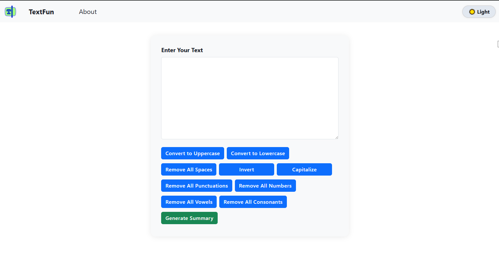

# TextFun

A modern, interactive text transformation and analysis tool built with React, Bootstrap, and JavaScript.

## Demo

https://fun-text.netlify.app/

### Watch it in action:

## Features

- **Convert Case:** Instantly convert text to uppercase or lowercase.
- **Remove Elements:** Remove all spaces, punctuations, numbers, vowels, or consonants.
- **Invert Text:** Reverse the text (from back to front).
- **Capitalize Sentences:** Properly capitalize sentences.
- **Text Summary:** Get character count (with and without spaces), word count, and estimated reading time.
- **Proper Formatting:** Automatically capitalize and punctuate your text.

## How to Use

1. **Open [https://fun-text.netlify.app/](https://fun-text.netlify.app/) in your browser.**
2. Enter or paste your text in the input area.
3. Use the buttons to transform your text as needed.
4. Click **Generate Summary** to see detailed statistics and formatted text.

## Tech Stack

- **React** (Frontend)
- **React Router** (Routing)
- **Bootstrap** (Styling)
- **JavaScript** (Logic)
- **Netlify** (Deployment)

## File Structure

- `src/pages/Index.jsx` — Main page and logic for text transformation.
- `src/components/Navbar.jsx` — Navigation bar.
- `src/assets/demo.png` — Screenshot of the app.
- `src/assets/demo.gif` — Demo GIF of the app.
- `README.md` — This documentation.

## Customization

You can easily modify the styles or add new features by editing the React components in the `src` folder.

---

Enjoy playing with your text!